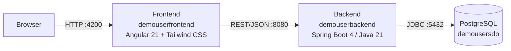
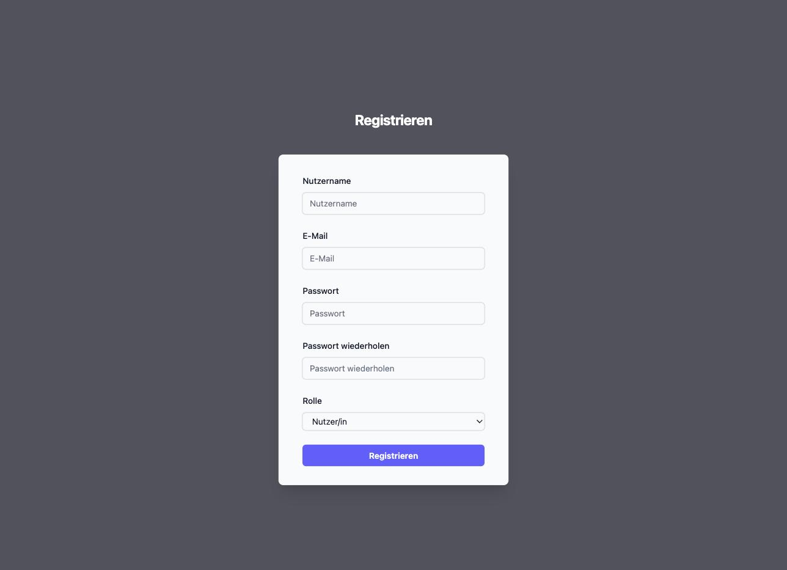
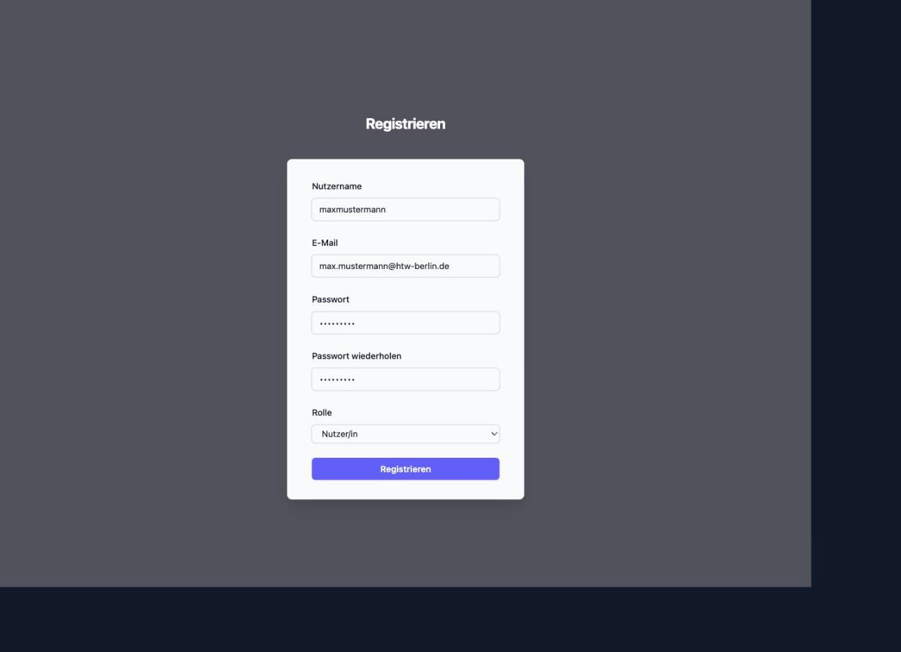
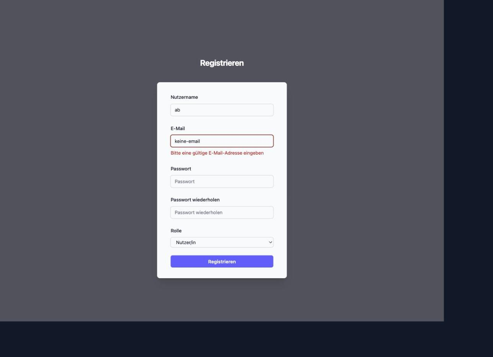

# DemoUser – Nutzerinnenverwaltung


Beispielprojekt einer Nutzerinnen-/Nutzerverwaltung (Registrierung, Login mit JWT, künftig rollenbasierte Autorisierung), bestehend aus einem Angular-Frontend und einem Spring-Boot-Backend. Das Projekt entsteht begleitend zur Lehrveranstaltung **Softwareentwicklungsprojekt** (3. Semester, HTW Berlin) und dient dort als durchgängiges Beispiel für Feature-Entwicklung, Git-Branching und die Zusammenarbeit über Issues und Pull Requests auf GitHub.

Diese README selbst ist Teil des Lehrmaterials: Sie soll Studierenden zeigen, wie eine aussagekräftige README für ein Softwareentwicklungsprojekt mit mehreren Teilsystemen aufgebaut sein kann.

## Inhaltsverzeichnis

- [Architektur](#architektur)
- [REST-API](#rest-api)
- [Screenshots](#screenshots)
- [Tech-Stack](#tech-stack)
- [Voraussetzungen](#voraussetzungen)
- [Erste Schritte](#erste-schritte)
  - [Backend starten](#backend-starten)
  - [Frontend starten](#frontend-starten)
- [Tests](#tests)
- [Projektstruktur](#projektstruktur)
- [Projektstatus](#projektstatus)
- [Zugehöriges Repository & Projektboard](#zugehöriges-repository--projektboard)
- [Workflow & Mitwirken](#workflow--mitwirken)
- [Lizenz](#lizenz)
- [Autor](#autor)

## Architektur

Das Projekt besteht aus zwei eigenständigen Repositories, die gemeinsam eine klassische 3-Schichten-Architektur bilden:



| Repository | Aufgabe |
|---|---|
| [`demouserfrontend`](.) (dieses Repo) | Angular-Single-Page-Application mit dem Registrierungsformular |
| [`demouserbackend`](https://github.com/jfreiheit/demobackenduser) | REST-API, Persistierung der `User`-Daten in PostgreSQL |

## REST-API

Das Backend stellt aktuell folgende Endpoints bereit:

| Methode | Pfad | Beschreibung | Antwort |
|---|---|---|---|
| `POST` | `/register` | Legt einen neuen `User` an (Passwort wird mit BCrypt gehasht) | `201 Created` mit Nutzerdaten (ohne Passwort), `400` bei ungültigen Eingaben, `409` bei doppeltem Nutzername/E-Mail |
| `POST` | `/login` | Prüft Nutzername/E-Mail + Passwort | `200 OK` mit signiertem JWT (HS256, 1 h gültig), `401` bei falschen Zugangsdaten |

Beispiel:

```bash
curl -X POST http://localhost:8080/register \
  -H "Content-Type: application/json" \
  -d '{"username":"erika","email":"erika@htw-berlin.de","password":"Sicher123","role":"user"}'

curl -X POST http://localhost:8080/login \
  -H "Content-Type: application/json" \
  -d '{"usernameOrEmail":"erika","password":"Sicher123"}'
```

Das zurückgegebene JWT wird bislang nur erzeugt, aber noch nicht zum Schutz weiterer Endpoints ausgewertet (siehe [Projektstatus](#projektstatus)).

## Screenshots

Registrierungsformular im Leerzustand:



Ausgefülltes, gültiges Formular (Absenden-Button aktiviert):



Client-seitige Validierung bei ungültiger Eingabe:



## Tech-Stack

**Frontend** (`demouserfrontend`)

- [Angular 21](https://angular.dev) mit Standalone Components
- neue [Signal Forms API](https://angular.dev/guide/forms) (`@angular/forms/signals`) statt `ReactiveFormsModule`
- [Tailwind CSS 4](https://tailwindcss.com) für das Styling

**Backend** (`demouserbackend`)

- [Spring Boot 4](https://spring.io/projects/spring-boot) (Java 21), Paket `htw.freiheit.user`
- Spring Data JPA / Hibernate
- [PostgreSQL](https://www.postgresql.org)

## Voraussetzungen

| Werkzeug | Version | Wofür |
|---|---|---|
| [Node.js](https://nodejs.org) | 20 LTS oder neuer | Frontend (Angular CLI) |
| [Java](https://adoptium.net) | 21 | Backend |
| [PostgreSQL](https://www.postgresql.org/download/) | 17 (ältere 4er-taugliche Versionen funktionieren ebenfalls) | Datenbank |

Ein Maven-Wrapper (`mvnw`) liegt im Backend-Repo bei, eine separate Maven-Installation ist also nicht nötig.

## Erste Schritte

### Backend starten

```bash
git clone https://github.com/jfreiheit/demobackenduser.git
cd demobackenduser
```

1. Lokale PostgreSQL-Instanz starten und darin eine Datenbank `demousersdb` anlegen (Standard-Benutzer `postgres`).
2. Datenbank-Passwort sowie ein Signierschlüssel für JWTs als Umgebungsvariablen setzen, bevor die Anwendung gestartet wird:

   ```bash
   export POSTGRESQL_PASSWORD=<dein-postgres-passwort>
   export JWT_SECRET=<mindestens-32-zeichen-langer-zufallsstring>
   ```

   Einen zufälligen Wert für `JWT_SECRET` erzeugt z. B. `openssl rand -base64 32`.

3. Anwendung starten:

   ```bash
   ./mvnw spring-boot:run
   ```

   Das Backend läuft anschließend unter `http://localhost:8080`. Da `spring.jpa.hibernate.ddl-auto=create` gesetzt ist, wird das Schema bei jedem Start neu aus den JPA-Entitäten erzeugt – Daten bleiben zwischen Neustarts **nicht** erhalten.

### Frontend starten

```bash
git clone https://github.com/jfreiheit/demofrontenduser.git
cd demofrontenduser
npm install
ng serve
```

Das Frontend ist anschließend unter `http://localhost:4200` erreichbar und lädt bei Änderungen an den Quelldateien automatisch neu.

## Tests

```bash
# Backend
cd demouserbackend
./mvnw test

# Frontend
cd demofrontenduser
ng test
```

## Projektstruktur

```
demofrontenduser/
├── src/app/
│   ├── register/        # Registrierungs-Komponente (Formular, Validierung, Styling)
│   └── app.routes.ts     # Routing
└── docs/screenshots/      # Screenshots für diese README

demouserbackend/
└── src/main/java/htw/freiheit/user/
    ├── model/            # JPA-Entität `User`
    ├── repository/        # `UserRepository`
    ├── security/          # Passwort-Hashing (BCrypt), JWT-Erzeugung
    ├── service/            # `UserService` (Registrierung, Login)
    ├── web/                # REST-Controller, DTOs, Fehlerbehandlung
    └── UserApplication.java
```

## Projektstatus

Beide Repositories befinden sich im frühen Aufbau und werden im Rahmen der Lehrveranstaltung schrittweise erweitert (Issue für Issue, siehe [Projektboard](#zugehöriges-repository--projektboard)):

- ✅ Registrierungsformular mit clientseitiger Validierung und Styling (Frontend)
- ✅ `User`-Entität, Repository inkl. CRUD-Tests, Datenbankanbindung (Backend)
- ✅ REST-Endpoint `POST /register` mit Passwort-Hashing und Validierung (Backend)
- ✅ REST-Endpoint `POST /login` mit JWT-Erzeugung (Backend)
- ⏳ Anbindung des Frontends an die Backend-Endpoints (aktuell simuliert das Formular das Absenden nur clientseitig)
- ⏳ Geschützte Endpoints und rollenbasierte Autorisierung anhand des JWT

## Zugehöriges Repository & Projektboard

- Backend-Repository: [github.com/jfreiheit/demobackenduser](https://github.com/jfreiheit/demobackenduser)
- Gemeinsames GitHub-Projectboard beider Repos: [github.com/users/jfreiheit/projects/1](https://github.com/users/jfreiheit/projects/1)

## Workflow & Mitwirken

Neue Features entstehen konsequent nach dem Muster *User Story → Akzeptanzkriterien als Sub-Issues → Feature-Branch → Commit(s) → Pull Request*. Der komplette Ablauf inklusive Branch- und Commit-Konventionen ist für die Lehrveranstaltung dokumentiert unter: [freiheit.f4.htw-berlin.de/projekte/git](http://freiheit.f4.htw-berlin.de/projekte/git/).

## Lizenz

Lehrmaterial der HTW Berlin für die Lehrveranstaltung Softwareentwicklungsprojekt – keine gesonderte Open-Source-Lizenz vergeben.

## Autor

Jörn Freiheit, HTW Berlin – [freiheit@htw-berlin.de](mailto:freiheit@htw-berlin.de)
