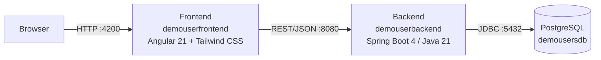

# DemoUser – Nutzerinnenverwaltung

Beispielprojekt einer Nutzerinnen-/Nutzerverwaltung (Registrierung, künftig Login/Rollen), bestehend aus einem Angular-Frontend und einem Spring-Boot-Backend. Das Projekt entsteht begleitend zur Lehrveranstaltung **Softwareentwicklungsprojekt** (3. Semester, HTW Berlin) und dient dort als durchgängiges Beispiel für Feature-Entwicklung, Git-Branching und die Zusammenarbeit über Issues und Pull Requests auf GitHub.

Diese README selbst ist Teil des Lehrmaterials: Sie soll Studierenden zeigen, wie eine aussagekräftige README für ein Softwareentwicklungsprojekt mit mehreren Teilsystemen aufgebaut sein kann.

## Architektur

Das Projekt besteht aus zwei eigenständigen Repositories, die gemeinsam eine klassische 3-Schichten-Architektur bilden:



| Repository | Aufgabe |
|---|---|
| [`demouserfrontend`](.) (dieses Repo) | Angular-Single-Page-Application mit dem Registrierungsformular |
| [`demouserbackend`](https://github.com/jfreiheit/demobackenduser) | REST-API, Persistierung der `User`-Daten in PostgreSQL |

## Screenshots

Registrierungsformular im Leerzustand:


Ausgefülltes, gültiges Formular (Absenden-Button aktiviert):


Client-seitige Validierung bei ungültiger Eingabe:


## Tech-Stack

**Frontend** (`demouserfrontend`)

- [Angular 21](https://angular.dev) mit Standalone Components
- neue [Signal Forms API](https://angular.dev/guide/forms) (`@angular/forms/signals`) statt `ReactiveFormsModule`
- [Tailwind CSS 4](https://tailwindcss.com) für das Styling

**Backend** (`demouserbackend`)

- [Spring Boot 4](https://spring.io/projects/spring-boot) (Java 21), Paket `htw.freiheit.user`
- Spring Data JPA / Hibernate
- [PostgreSQL](https://www.postgresql.org)

## Voraussetzungen

| Werkzeug | Version | Wofür |
|---|---|---|
| [Node.js](https://nodejs.org) | 20 LTS oder neuer | Frontend (Angular CLI) |
| [Java](https://adoptium.net) | 21 | Backend |
| [PostgreSQL](https://www.postgresql.org/download/) | 17 (ältere 4er-taugliche Versionen funktionieren ebenfalls) | Datenbank |

Ein Maven-Wrapper (`mvnw`) liegt im Backend-Repo bei, eine separate Maven-Installation ist also nicht nötig.

## Erste Schritte

### Backend starten

```bash
git clone https://github.com/jfreiheit/demobackenduser.git
cd demobackenduser
```

1. Lokale PostgreSQL-Instanz starten und darin eine Datenbank `demousersdb` anlegen (Standard-Benutzer `postgres`).
2. Datenbank-Passwort als Umgebungsvariable setzen, bevor die Anwendung gestartet wird:

   ```bash
   export POSTGRESQL_PASSWORD=<dein-postgres-passwort>
   ```

3. Anwendung starten:

   ```bash
   ./mvnw spring-boot:run
   ```

   Das Backend läuft anschließend unter `http://localhost:8080`. Da `spring.jpa.hibernate.ddl-auto=create` gesetzt ist, wird das Schema bei jedem Start neu aus den JPA-Entitäten erzeugt – Daten bleiben zwischen Neustarts **nicht** erhalten.

### Frontend starten

```bash
git clone https://github.com/jfreiheit/demofrontenduser.git
cd demofrontenduser
npm install
ng serve
```

Das Frontend ist anschließend unter `http://localhost:4200` erreichbar und lädt bei Änderungen an den Quelldateien automatisch neu.

## Tests

```bash
# Backend
cd demouserbackend
./mvnw test

# Frontend
cd demofrontenduser
ng test
```

## Projektstruktur

```
demofrontenduser/
├── src/app/
│   ├── register/        # Registrierungs-Komponente (Formular, Validierung, Styling)
│   └── app.routes.ts     # Routing
└── docs/screenshots/      # Screenshots für diese README

demouserbackend/
└── src/main/java/htw/freiheit/user/
    ├── model/            # JPA-Entität `User`
    ├── repository/        # `UserRepository`
    └── UserApplication.java
```
