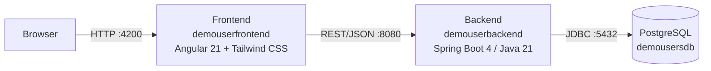

# DemoUser – Nutzerinnenverwaltung

Beispielprojekt einer Nutzerinnen-/Nutzerverwaltung (Registrierung, künftig Login/Rollen), bestehend aus einem Angular-Frontend und einem Spring-Boot-Backend. Das Projekt entsteht begleitend zur Lehrveranstaltung **Softwareentwicklungsprojekt** (3. Semester, HTW Berlin) und dient dort als durchgängiges Beispiel für Feature-Entwicklung, Git-Branching und die Zusammenarbeit über Issues und Pull Requests auf GitHub.

Diese README selbst ist Teil des Lehrmaterials: Sie soll Studierenden zeigen, wie eine aussagekräftige README für ein Softwareentwicklungsprojekt mit mehreren Teilsystemen aufgebaut sein kann.

## Architektur

Das Projekt besteht aus zwei eigenständigen Repositories, die gemeinsam eine klassische 3-Schichten-Architektur bilden:

| Repository | Aufgabe |
|---|---|
| [`demouserfrontend`](.) (dieses Repo) | Angular-Single-Page-Application mit dem Registrierungsformular |
| [`demouserbackend`](https://github.com/jfreiheit/demobackenduser) | REST-API, Persistierung der `User`-Daten in PostgreSQL |

## Tech-Stack

**Frontend** (`demouserfrontend`)

- [Angular 21](https://angular.dev) mit Standalone Components
- neue [Signal Forms API](https://angular.dev/guide/forms) (`@angular/forms/signals`) statt `ReactiveFormsModule`
- [Tailwind CSS 4](https://tailwindcss.com) für das Styling

**Backend** (`demouserbackend`)

- [Spring Boot 4](https://spring.io/projects/spring-boot) (Java 21), Paket `htw.freiheit.user`
- Spring Data JPA / Hibernate
- [PostgreSQL](https://www.postgresql.org)
